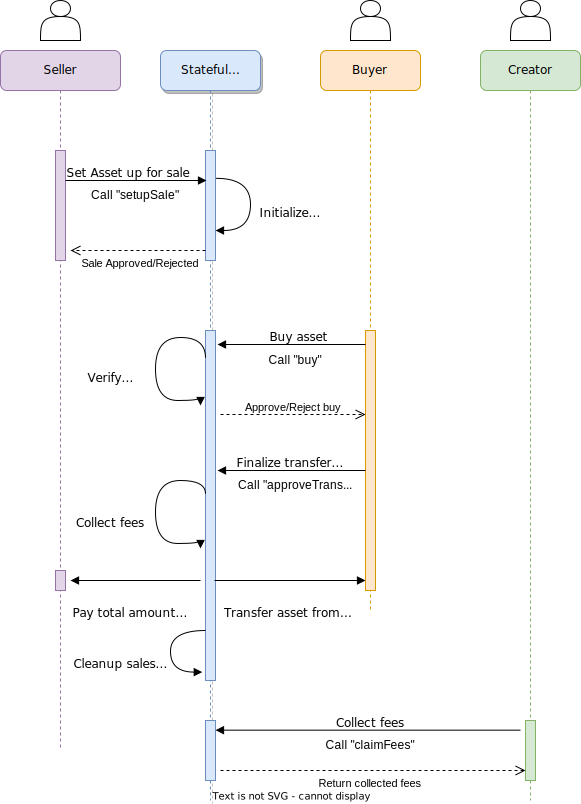

# Royalty Fees on Algorand
This is a short tutorial that explains how to implement Royalty Fees using Inner Transactions and Teal v5 capabilities in Algorand.
The smart contract has been written in PyTeal, and all the examples are written using Typescript.

We assume that the reader has programming knowledge, and that she/he is already familiarity with Blockchains technology.


## 0. Requirements
We assume that the reader has programming knowledge, and that she/he is already familiarity with Blockchains technology.

Other requirements:


1. Have a running [Algorand node](https://developer.algorand.org/docs/run-a-node/setup/install), or [use the sandbox](https://github.com/algorand/sandbox)
2. Having PyTeal installed (requires python 3)
3. Install [Node-js](https://nodejs.org/) for the examples, together with the ``algosdk`` library, ``typescript`` and ``ts-node``

Please, check [README file](https://github.com/rssalessio/algorand-royalty-fees/blob/main/README.md) for more instructions.


## 1. Introduction
**Royalty Fees play a huge role in the future of Blockchains, since they enable the possibility of guaranteeing fees  on second sales of an asset.** Unfortunately, Royalty Fees are yet not fully implemented on Blokchains. 

For example, [in Ethereum it is not possible to enforce Royalty fees on second sales](https://eips.ethereum.org/EIPS/eip-2981). As a consequence, marketplaces in Ethereum have to implement an internal solution to provide Royalty Fees, which can be easily avoided if the users avoid selling on that specific marketplace.

**Algorand on the other hand has some features that make it a candidate blockchain where to implement Royalty Fees**. These features are:
1. Possibility to freeze an asset, and block the transfer of an asset
2. Possibility to send transactions and move assets using smart contracts (Teal 5)

**An earlier project on Algorand, [Algorealm](https://github.com/cusma/algorealm), shows a first implementation of Royalty Fees on Algorand by using a [**clawback** address](https://developer.algorand.org/docs/get-details/transactions/transactions#clawbackaddr) and Teal v2**. However, the smart contract implemented in Algorealm  (which is the union of a [Stateful App](https://developer.algorand.org/docs/get-details/dapps/smart-contracts/apps/) and 1 [Smart signature](https://developer.algorand.org/docs/get-details/dapps/smart-contracts/smartsigs/)) only accepts or rejects the transfer of an asset, and it is not able to  compute automatically a royalty fee, or too automatically move an asset. In their proposal they make use of a smart contract that allows the transfer of an asset only upon payment of a specific royalty fee. Because of these limitations, their implementation is application-specific, and hard to scale.

**Now it is possible to do much better by exploiting the capabilities of Teal v5**. It is possible to implement only 1 [stateful App](https://developer.algorand.org/docs/get-details/dapps/smart-contracts/apps/) that handles automatically the payment of royalty fees, and the transfer of assets using [Inner Transactcions](https://developer.algorand.org/docs/get-details/dapps/smart-contracts/apps/?from_query=inner%20transactions#inner-transactions).

## 2. Method to collect royalty fees
**Roughly speaking, the method works as follows:**
1. The seller sets up an asset for sale on the App (the smart contract)
2. The buyer pays the amount specified by the seller to the App
3. If the buyer is fully convinced he/she can continue with the payment
   * The asset is transfered from the seller to the buyer
   * The app pays the seller the total amount minus the royalty fees
   * Royalty fees are collected in the App. The owner of the royalty fees (the Creator of the asset) can redeem the royalty fees whenever he/she wants.

The method is also described the following UML diagram



One may wonder why it is necessary for the Buyer to first pay and then finalize the transfer. I personally prefer it this way. How many times you bought something and then you regretted doing so?

In case you don't like this solution, it is still possible to combine all the steps together (I will explain this later).

## 3. Creating the contract (approval program)
The smart contract  consists of an approval program and a clearance program. The latter simply returns 1 to all requests, therefore we just focus on the former.

We assume for simplicity that the contract is deployed directly by the creator of the asset, the one that will collect all royalty fees. In this way the smart contract can be directly intialized by the creator.

We start by defining a list of constants that will turn out to be useful while developing the App.
```python
from pyteal import *
import sys

class Constants:
    """
        Constant strings used in the smart contracts
    """
    Creator           = Bytes("Creator")         # Identified the account of the Asset creator, stored globally
    AssetId           = Bytes("AssetId")         # ID of the asset, stored globally
    amountPayment     = Bytes("amountPayment")   # Amount to be paid, stored locally on the seller's account
    amountASA         = Bytes("amountASA")       # Amount of asset sold, stored locally on the seller's account
    approveTransfer   = Bytes("approveTransfer") # Approval variable, stored on the seller's and buyer's accounts
    setupSale         = Bytes("setupSale")       # Method call
    buyASA            = Bytes("buyASA")          # Method call
    executeTransfer   = Bytes("executeTransfer") # Method call
    royaltyFee        = Bytes("royaltyFee")      # Royalty fee in thousands
    claimFees         = Bytes("claimFees")       # Method call
    collectedFees     = Bytes("collectedFees")   # Amount of collected fees, stored globally
    refund            = Bytes("refund")          # Method call
```

After having defined the list of constants, we can write the piece of code that is executed upon calling the contract.
We define the ```python approval_program()``` function, which contains the code executed by the App. This function returns the following piece of code
```python
# Check the transaction type and execute the corresponding code
#   1. If application_id() is 0 then the program has just been created, so we initialize it
#   2. If on_completion() is 0 we execute the onCall code
return If(Txn.application_id() == Int(0)).Then(initialize)                  \
        .ElseIf(Txn.on_completion() == OnComplete.CloseOut).Then(Approve()) \
        .ElseIf(Txn.on_completion() == OnComplete.OptIn).Then(Approve())    \
        .ElseIf(Txn.on_completion() == Int(0)).Then(onCall)                 \
        .Else(Reject())
```
We start by checking if the App has just been initialized. If so we call the sequence contained in the variable ``initialize``. On ``CloseOut`` or ``OptIn`` we simply approve the transaction. Otherwise, if it is a [``NoOp`` transaction](https://developer.algorand.org/docs/get-details/transactions/#application-noop-transaction), we execute the code in ``onCall``.

The ``initialize`` sequence is defined as follows
```python
# [Step 1] Sequence used to initialize the smart contract. Should be called only at creation
royaltyFeeArg = Btoi(Txn.application_args[2])
initialize = Seq([
    Assert(Txn.type_enum() == TxnType.ApplicationCall),             # Check if it's an application call
    Assert(Txn.application_args.length() == Int(3)),                # We need 3 arguments, Creator, AssetId and Royalty Fee
    Assert(royaltyFeeArg >= Int(0) and royaltyFeeArg <= Int(1000)), # verify that the Royalty fee is in [0, 1000]
    App.globalPut(Constants.Creator, Txn.application_args[0]),      # Save the initial creator
    App.globalPut(Constants.AssetId, Btoi(Txn.application_args[1])),# Save the asset ID
    App.globalPut(Constants.royaltyFee, royaltyFeeArg),             # Save the royalty fee
    Approve()
])
```
In the ``initialize`` sequence we expect 3 arguments: (1) the wallet's address of the creator, (2) the asset ID and the (3) royalty fee in thousands. We save all these variables in the global state of the contract (2 integers and 1 Bytes slice).


On the other hand, going back to the previous piece of code, the ``onCall`` method is an ``If`` statement that checks which action the user wants to perform:
```python
# onCall Sequence
# Checks that the first transaction is an Application call, and then checks
# the first argument of the call. The first argument must be a valid value between
# "setupSale", "buyASA", "executeTransfer", "refund" and "claimFees"
onCall = If(Gtxn[0].type_enum() != TxnType.ApplicationCall).Then(Reject())                        \
         .ElseIf(Gtxn[0].application_args[0] == Constants.setupSale).Then(setupSale)              \
         .ElseIf(Gtxn[0].application_args[0] == Constants.buyASA).Then(buyASA)                    \
         .ElseIf(Gtxn[0].application_args[0] == Constants.executeTransfer).Then(executeTransfer)  \
         .ElseIf(Gtxn[0].application_args[0] == Constants.refund).Then(refund)                    \
         .ElseIf(Gtxn[0].application_args[0] == Constants.claimFees).Then(claimFees)              \
         .Else(Reject())
````
First, we check that the user called the smart contract correctly. Then we check the first argument of ``application_args`` (we use the first argument to discriminate between the various operations). As you can see in the code there is a list of ``ElseIf`` statementents that are used to distinguish between the various values. The accepted values are ``setupSale, buyASA, executeTransfer, refund, claimFees``.
1. ``setupSale`` Can be called by any user, and it is used to set up a new sale.
2. ``buyASA`` Any user that wants to buy the asset needs to call this method first.
3. ``executeTransfer`` After paying, the buyer can finalize by transfering the asset to his/her wallet. Alternatively, the user can get the money back by calling the ``refund method``
4. ``refund`` This method can be used by the buyter to get the money back
5. ``claimFees`` This method can only be called by the creator of the asset to collect royalty fees

Note that we obviously reject all other undefined requests. 

We will now go thorugh these 5 methods, but, before doing so, we first define some useful subroutines that will come in handy later on.

### 3.1 SetupSale method
We begin by looking at the ``setupSale`` method. In this case the user (the seller) has to provide the sale price and the total amount of asset.
```python
# [Step 2] Sequence that sets up the sale of an ASA
# There should be 3 arguments: 
#   1. The first argument is the command to execute, in this case "setupSale"
#   2. The second one is the payment amount
#   3. The third one is the amount of ASA transfered
# We first verify the the seller has enough ASA to sell, and then we locally save the arguments
priceArg = Btoi(Txn.application_args[1])
amountOfASAArg = Btoi(Txn.application_args[2])
setupSale = Seq([
    Assert(Txn.application_args.length() == Int(3)),                                      # Check that there are 3 arguments
    Assert(Global.group_size() == Int(1)),                                                # Verify that it is only 1 transaction
    Assert(priceArg != Int(0)),                                                           # Check that the price is different than 0
    Assert(amountOfASAArg != Int(0)),                                                     # Check that the amount of ASA to transfer is different than 0                
    Assert(                                                                               # Verify that the seller has enough ASA to sell
        getAccountASABalance(Txn.sender(), App.globalGet(Constants.AssetId))
            >=  amountOfASAArg),
    Assert(priceArg > serviceCost),                                                       # Check that the price is greater than the service cost
    App.localPut(Txn.sender(), Constants.amountPayment, priceArg),                        # Save the price
    App.localPut(Txn.sender(), Constants.amountASA, amountOfASAArg),                      # Save the amount of ASA to transfer
    App.localPut(Txn.sender(), Constants.approveTransfer, Int(0)),                        # Reject transfer until payment is done
    Approve()
])
```
In the code above we start by doing some standard checks. Note that we use  the following code to check that the seller has indeed the asset available for sale
```python
Assert(getAccountASABalance(Txn.sender(), App.globalGet(Constants.AssetId)) >=  amountOfASAArg),
```
where ``getAccountASABalance`` is a subRoutine that we can use to retrieve the amount of asset held by a certain wallet. We will give a look to this subroutine later in section  3.6.
The code ends by checking that the sale price is greater than the service cost (which is 2000 microalgo in this case), and we save in the local account of the seller these variables. We also save the ``approveTransfer`` variable, and set it equal to 0.

### 3.2 BuyASA method
The next method we look at is the ``buyASA`` method. Calling this method requires 2 transaction:
1. The first one is a NoOp application call with 3 arguments: the "buyASA" argument, the asset id and the amount of ASA to buy
2. The second transaction is a payment (that pays the full price). The receiver is the contract itself.

The code starts by loading some useful variables (the seller address, the amount to be paid, etc...) and does some standard checks. We make sure that the seller has not approved another buyer, and that the seller holds enough ASA. 

If all conditions are satisfied,  we approve the transfer from both the seller's and buyer's perspectives. At this point the buyer only needs to finalize the transaction to transfer the asset.

```python
# [Step 3] Sequence that approves the payment for the ASA
# This step requires 2 transaction.
# The first transaction is a NoOp App call transaction. There should be 3 arguments: 
#   1. The first argument is the command to execute, in this case "buyASA"
#   2. The second argument is the asset id
#   3. The third argument is the amount of ASA to buy
# Moreover, in the first transaction we also pass the seller's address
# The second transaction is a payment (the receiver is the app).

# Save some useful variables
seller = Gtxn[0].accounts[1]                                                              # Save seller's address
amountToBePaid = App.localGet(seller, Constants.amountPayment)                            # Amount to be paid
amountAssetToBeTransfered = App.localGet(seller, Constants.amountASA)                     # Amount of ASA
approval = App.localGet(seller, Constants.approveTransfer)                                # Variable that checks if the transfer has alraedy been approved
buyer = Gtxn[0].sender()
buyASA = Seq([
    Assert(Gtxn[0].application_args.length() == Int(3)),                                  # Check that there are 3 arguments
    Assert(Global.group_size() == Int(2)),                                                # Check that there are 2 transactions
    Assert(Gtxn[1].type_enum() == TxnType.Payment),                                       # Check that the second transaction is a payment
    Assert(App.globalGet(Constants.AssetId) == Btoi(Gtxn[0].application_args[1])),        # Check that the assetId is correct
    Assert(approval == Int(0)),                                                           # Check that the transfer has not been issued yet
    Assert(amountToBePaid == Gtxn[1].amount()),                                           # Check that the amount to be paid is correct
    Assert(amountAssetToBeTransfered == Btoi(Gtxn[0].application_args[2])),               # Check that there amount of ASA to sell is correct
    Assert(Global.current_application_address() == Gtxn[1].receiver()),                   # Check that the receiver of the payment is the App
    Assert(                                                                               # Verify that the seller has enough ASA to sell
        getAccountASABalance(seller, App.globalGet(Constants.AssetId))              
            >=  amountAssetToBeTransfered),
    App.localPut(seller, Constants.approveTransfer, Int(1)),                              # Approve the transfer from seller' side
    App.localPut(buyer, Constants.approveTransfer, Int(1)),                               # Approve the transfer from buyer' side
    Approve()
])
```
### 3.3 ExecuteTransfer method
Finally, we have the sequence that finalizes the transfer. At this point the buyer is still able to get back the money, and cancel the transfer. If the buyer calls ``executeTransfer``, then the transfer is finalized. The asset is moved from the seller to the buyer, and the seller receives the payment minus the royalty fees.

We use the subroutine ``computeRoyaltyFee`` to compute the royalty fee given the total payment minus the service cost.

Apart from the usual checks, we also make sure that both the seller and the buyer already approved the transaction. We then transfer the asset, and send the papyment to the seller using the subroutines ``transferAsset`` and ``sendPayment``. Finally, we conclude by collecting the royalty fees for the creator and by deleting all the local variables.
```python
# [Step 4] Sequence that transfers the ASA, pays the seller and sends royalty fees to the creator
# This step requires 1 transaction.
# The  transaction is a NoOp App call transaction. There should be 1 arguments
#   1. The first argument is the command to execute, in this case "executeTransfer"
# We also account for the serviceCost to pay the inner transaction
royaltyFee = App.globalGet(Constants.royaltyFee)
collectedFees = App.globalGet(Constants.collectedFees)
feesToBePaid = computeRoyaltyFee(amountToBePaid - serviceCost, royaltyFee)
executeTransfer = Seq([
    Assert(Gtxn[0].application_args.length() == Int(1)),                            # Check that there is only 1 argument
    Assert(Global.group_size() == Int(1)),                                          # Check that is only 1 transaction
    Assert(App.localGet(seller, Constants.approveTransfer) == Int(1)),              # Check that approval is set to 1 from seller' side
    Assert(App.localGet(buyer, Constants.approveTransfer) == Int(1)),               # Check approval from buyer' side
    Assert(                                                                         # Verify that the seller has enough ASA to sell
        getAccountASABalance(seller, App.globalGet(Constants.AssetId))              
            >=  amountAssetToBeTransfered),
    Assert(amountToBePaid - serviceCost > feesToBePaid),
    transferAsset(seller,                                                           # Transfer asset
                  Gtxn[0].sender(),
                  App.globalGet(Constants.AssetId), amountAssetToBeTransfered),
    sendPayment(seller, amountToBePaid - serviceCost - feesToBePaid),               # Pay seller
    App.globalPut(Constants.collectedFees, collectedFees + feesToBePaid),           # Collect fees, perhaps check for overflow?
    App.localDel(seller, Constants.amountPayment),                                  # Delete local variables
    App.localDel(seller, Constants.amountASA),
    App.localDel(seller, Constants.approveTransfer),
    App.localDel(buyer, Constants.approveTransfer),
    Approve()
])
```
### 3.4 Refund Method
In case the buyer has already paid, but not finalized the transaction using the ``executeTransfer`` sequence, it is still possible to claim back the funds by calling ``refund``. This sequence of code checks that the payment was done, and sends back to the buyer the total payment amount minus the transaction fee.

We end by cleaning the local variables.

```python
# Refund sequence
# The buyer can get a refund if the payment has already been done but the NFT has not been transferred yet
refund = Seq([
    Assert(Global.group_size() == Int(1)),                                           # Verify that it is only 1 transaction
    Assert(Txn.application_args.length() == Int(3)),                                 # Check that there is only 1 argument
    Assert(App.localGet(seller, Constants.approveTransfer) == Int(1)),               # Asset that the payment has already been done
    Assert(App.localGet(buyer, Constants.approveTransfer) == Int(1)),
    Assert(amountToBePaid > Int(1000)),                                              # Verify that the amount is greater than the transaction fee
    sendPayment(buyer, amountToBePaid - Int(1000)),                                  # Refund buyer
    App.localPut(seller, Constants.approveTransfer, Int(0)),                         # Reset local variables
    App.localDel(buyer, Constants.approveTransfer),
    Approve()
])
```
### 3.5 claimFees Method
Finally, we also create the ``claimFees`` method that can be called by the creator of the asset. This simply sends a payment to the creator with the collected amount of fees.

```python
# Claim Fees sequence
    # This sequence can be called only by the creator.  It is used to claim all the royalty fees
    # It may fail if the contract has not enough algo to pay the inner transaction (the creator should take
    # care of funding the contract in this case)
    claimFees = Seq([
        Assert(Global.group_size() == Int(1)),                                                 # Verify that it is only 1 transaction
        Assert(Txn.application_args.length() == Int(3)),                                       # Check that there is only 1 argument
        Assert(Txn.sender() == App.globalGet(Constants.Creator)),                              # Verify that the sender is the creator
        Assert(App.globalGet(Constants.collectedFees) > Int(0)),                               # Check that there are enough fees to collect
        sendPayment(App.globalGet(Constants.Creator), App.globalGet(Constants.collectedFees)), # Pay creator
        App.globalPut(Constants.collectedFees, Int(0)),                                        # Reset collected fees
        Approve()
    ])
```

### 3.6 Subroutines
In this section I explain some of the subroutines that appears in the code. I use 4 subroutines
1. ``sendPayment(receiver: Addr, amount: Int) -> Expr``: this subroutines sends a payment to a specific wallet
2. ``transferAsset(sender: Addr, receiver: Addr, assetId: Int, amount: Int) -> Expr``: this subroutine transfers an asset from a wallet to another (the app must be set as clawback address for the asset)
3. ``getAccountASABalance(account: Addr, assetId: Int) -> TealType.uint64``: this subroutine is used to find the amount of asset held by a certain wallet
4. ``computeRoyaltyFee(amount: Int, royaltyFee: Int) -> TealType.uint64``: this subroutine computes the royalty fees given a certain price

#### 3.6.1 SendPayment
The ``SendPayment`` subroutine can be used to pay a wallet by submitting an inner transaction. Check also the description of the subroutine in the code.
```python
@Subroutine(TealType.none)
def sendPayment(receiver: Addr, amount: Int) -> Expr:
    """
    This subroutine can be used to send payments from the smart
    contract to other accounts using inner transactions

    :param Addr receiver : The receiver of the payment
    :param Int amount    : Amount to send in microalgos
    """
    return Seq([
        InnerTxnBuilder.Begin(),
        InnerTxnBuilder.SetFields({
            TxnField.type_enum: TxnType.Payment,
            TxnField.amount: amount,
            TxnField.receiver: receiver,
            TxnField.fee: Int(1000)
        }),
        InnerTxnBuilder.Submit(),
    ])
```

#### 3.6.2 TransferAsset
The ``TransferAsset`` subroutine can be used to transfer the asset being sold from one account to another using an inner transaction (note that the contract must be the clawback address for that asset).
```python
@Subroutine(TealType.none)
def transferAsset(sender: Addr, receiver: Addr, assetId: Int, amount: Int) -> Expr:
    """
    This subroutine can be used to transfer an asset
    from an account to another. 
    
    This subroutine can also be used to opt in an asset if ``amount``
    is 0 and ``sender`` is equal to ``receiver``.

    :param Addr sender   : Asset sender
    :param Addr receiver : Asset receiver
    :param Int assetId   : ID of the asset. Note that the id must also be passed in the ``foreignAssets``
                           field in the outer transaction (otherwise you will get a reference error)
    :param Int amount    : The amount of the asset to be transferred. A zero amount transferred to self allocates
                           that asset in the account's Asset map.
    """
    return Seq([
        InnerTxnBuilder.Begin(),
        InnerTxnBuilder.SetFields({
            TxnField.type_enum: TxnType.AssetTransfer,
            TxnField.asset_amount: amount,
            TxnField.asset_receiver: receiver,
            TxnField.asset_sender: sender,
            TxnField.xfer_asset: assetId,
            TxnField.fee: Int(1000)
        }),
        InnerTxnBuilder.Submit(),
    ])
```

#### 3.6.3 getAccountASABalance
The ``getAccountASABalance`` can be used to get the balance of a specific asset for a specific wallet. It uses the ``AssetHolding.balance`` method to retrieve the balanace.

```python
@Subroutine(TealType.uint64)
def getAccountASABalance(account: Addr, assetId: Int) -> TealType.uint64:
    """
    This subroutine returns the amount of ASA held by a certain
    account. Note that the asset id must also be passed in the ``foreignAssets``
    field in the outer transaction (otherwise you will get a reference error)

    :param Addr account  : The account to verify
    :param Int assetId   : ASA Id
    :return              : Amount of ASA held by the account
                           Returns 0 if the account does not have
                           any ASA of type ``assetId``.
    :rtype               : Int            
    """
    AssetAccountBalance = AssetHolding.balance(account, assetId)
    return Seq([
        AssetAccountBalance,
        If(AssetAccountBalance.hasValue() == Int(1)) \
        .Then(AssetAccountBalance.value())           \
        .Else(Int(0))
    ])
```
#### 3.6.4 computeRoyaltyFee
Last, but not least, we have the the ``computeRoyaltyFee`` subroutine. This subroutine computes the fee for a specific payment amount and a given royalty fee (in thousands). For example suppose one wants to set a royalty fee of 3.5%. In thousands is 35 (0.035 * 1000).

Given an amount ``x`` we need to compute ``x * 35 / 1000`` to compute the royalty fee. Since there may be a remainder, we also need to consider ``(x * 35) % 1000``. THe remainder will be used to round up the fee (if it is greater than 500 then we round up, otherwise we round down).

Read also the description of the subrotuine for more information.
```python
@Subroutine(TealType.uint64)
def computeRoyaltyFee(amount: Int, royaltyFee: Int) -> TealType.uint64:
    """
    This subroutine computes the fee given a specific ``amount`` and the
    predefined ``royaltyFee``.
    The ``royaltyFee`` variable must be expressed in thousands.

    Note that we assume that amount * royaltyFee will not overflow.
    In case it does, it will trigger an error and the transaction will
    fail.

    :param Int amount       : The amount paid
    :param Int royaltyFee   : The royalty fee (in thousands)
    :return                 : Fee to be paid in microAlgos
    :rtype                  : Int            
    """
    # If Mul() overflows the transaction will fail
    remainder = Mod(Mul(amount, royaltyFee), Int(1000))
    division = Div(Mul(amount, royaltyFee), Int(1000))

    # Computes the royalty fee. If the fee is equal to 0, or the amount is very small
    # the fee will be 0.
    # If the royalty fee is larger or equal to 1000 then we return the original amount.
    # If the remainder of royaltyFee * amount / 1000 is larger than 500 we round up the
    # result and return  1 + royaltyFee * amount / 1000. Otherwise we just return
    # royaltyFee * amount / 1000.
    return If(Or(royaltyFee == Int(0), division == Int(0))).Then(Int(0))   \
           .ElseIf(royaltyFee >= Int(1000)).Then(amount)                   \
           .ElseIf(remainder > Int(500)).Then(division + Int(1))           \
           .Else(division)
```
### 3.7 Possible improvements and missing checks
There ase several possible improvements that can be made. 

1. First, note that the code is not production ready since it misses some checks that are needed to guarantee safety.

2. Secondly, the buyer may potentially pay for the asset, but never transfer it. This would freeze the total paid amount inside the contract. To solve this issue we can do the following:
    1. Impose that the executionTransfer must happen in a finite number of rounds
    2. Let the seller reset the payment if the transfer has not happened after that finite number of rounds.

    Alternatively, we can just transfer immediately (after the payment) the asset to the buyer, without the need of confirming the transfer.
3. We could also send the royalty fees immediately to the creator when the asset is transferred (by using another innerTransaction).

## 4. Setting up an Example scenario
We simulate an example scenario where we sell the asset 2 times. For this example we consider the simple scenario that the asset is an NFT.
We need 3 wallets: 
1. ``wallet1`` creator of the asset, and deployer of the smart contract (this is not strictly required!)
2. ``wallet2`` First buyer
3. ``wallet3`` Second buyer

We proceed as follows
1. We start by creating the Asset using ``wallet1``
2. Deploy the smart contract using ``wallet1``
3. ``wallet1`` puts the NFT up for sale and ``wallet2`` buys it
4. ``wallet2`` puts the NFT up for sale and ``wallet3`` buys it
5. Finally, we redeem the fees using ``wallet1``

### 4.1 Creating the asset
We start by creating the asset (note that the asset is initially frozen). In this part of the tutorial I assume that there exists a variable ``$WALLET1_ADDR`` that contains the address of ``wallet1``.

We also save the asset id variable in ``$ASSET_ID`` and make ``wallet2`` and ``wallet3`` opt-in the asset.

```console
# Create the asset
goal asset create --creator $WALLET1_ADDR --name "SpecialNFT" --unitname "SNFT" --total 1 --decimals 0 --defaultfrozen

# Save the Asset ID
export ASSET_ID="$(goal asset info --creator $WALLET1_ADDR --unitname "SNFT"  | awk '{print $3}' | head -1)"

# Asset Opt in
goal asset send --amount 0 --to $WALLET2_ADDR --assetid $ASSET_ID
goal asset send --amount 0 --to $WALLET3_ADDR --assetid $ASSET_ID
```
### 4.2 Creating the App and setting the clawback address
Now we deploy the smart contract using ``wallet1``, and make all the wallets opt-in the app.

```console
# Royalty fee 3.5%, in thousands
ROYALTY_FEE=35

# compile PyTeal into TEAL
python3 src/smart_contract.py src/approval.teal src/clear.teal

# create app
GLOBAL_BYTES_SLICES=1
GLOBAL_INTS=3
LOCAL_BYTES_SLICES=1
LOCAL_INTS=5

export APP_ID=$(
  goal app create --creator "$WALLET1_ADDR" \
    --approval-prog src/approval.teal \
    --clear-prog src/clear.teal \
    --global-byteslices "$GLOBAL_BYTES_SLICES" \
    --global-ints "$GLOBAL_INTS" \
    --local-byteslices "$LOCAL_BYTES_SLICES" \
    --local-ints "$LOCAL_INTS" \
    --app-arg addr:$WALLET1_ADDR \
    --app-arg int:$ASSET_ID \
    --app-arg int:$ROYALTY_FEE |
    grep Created |
    awk '{ print $6 }'
)


# Export App Address
export APP_ADDRESS=$(${gcmd} app info  --app-id "$APP_ID" | awk '{print $3}' | head -2 | tail -1)
echo -e "\e[1;32mApp ID:\e[0m $APP_ADDRESS"

# Fund App
goal clerk send -a 200000 -f $WALLET1_ADDR -t $APP_ADDRESS -N

# Setting clawback
goal asset config --assetid $ASSET_ID --manager $WALLET1_ADDR --new-clawback $APP_ADDRESS --new-freezer $APP_ADDRESS --new-manager ""

# App opt in
goal app optin --app-id $APP_ID --from $WALLET1_ADDR
goal app optin --app-id $APP_ID --from $WALLET2_ADDR
goal app optin --app-id $APP_ID --from $WALLET3_ADDR
```


### 4.3 Simulate sale from ``wallet1`` to ``wallet2``
Here we simulate the sale from ``wallet1`` to ``wallet2``. 
1. We first fix a price and amount, and call the ``setupSale`` method using ``wallet1``. We must pass 3 arguments: (1) ``setupSale``, (2) the price, (3) the amount. Moreover, we also need to specify the asset id using the ``--foreign-asset`` command.
2. 


```console
NFT_AMOUNT=1
NFT_PRICE=1000000
goal app call --app-id $APP_ID --from $WALLET1_ADDR --app-arg str:setupSale --app-arg int:$NFT_PRICE --app-arg int:$NFT_AMOUNT --foreign-asset $ASSET_ID
```
### 4.4 Simulate sale from ``wallet2`` to ``wallet3``
### 4.5 Verify royalty fees

## 5. Conclusions

